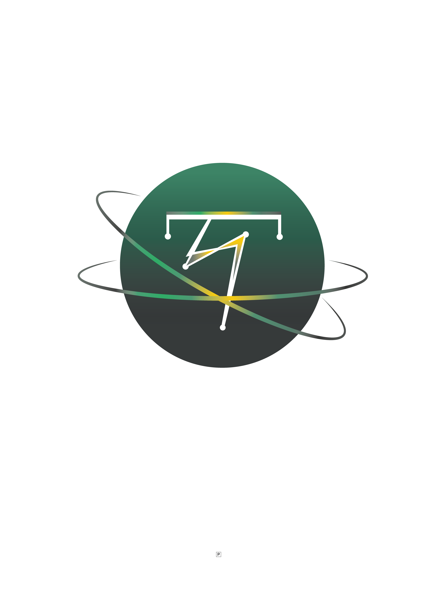

<div align="center">

</div>
<div align="center">
 <p><b>Own your data, empower your world!</b></p>
</div>

# $XSGD ZILHive Hackathon

## Peer-to-peer donations between tyron.did decentralized identities

In times when people need it the most, the first use case for @tyrondid self-sovereign identities will be peer-to-peer donations - help your community!

A react native decentralized app, pung.me is a prototype that allows your digital identity to send Xfers's $XSGD to another 'domain.did' with no tyronzil transaction fee, paying only for Zilliqa gas, currently less than $0.12.

Donation campaign codes, e.g. 'covid-aid', get registered in your DID contract with a duration of 1 week.

Read the user-owned DID smart contract [here](https://github.com/julio-cabdu/tyronZIL-js/blob/master/src/lib/blockchain/smart-contracts/didc.scilla).

```
expo start
```

Demo file [here](./pungme-demo.webm).

## On the DID contract side

### Mutable fields

```
  (* The xWallet fields *)
  (*--------------------*)
  (* SSI Token implementations
   @key:  address
   @value: token name *)
  field xWallet: Map ByStr20 String = Emp ByStr20 String

  (* SSI Token balances
   @key: token name
   @value: balance *)
  field xBalances: Map String Uint128 = Emp String Uint128

  (* SSI Token proxies
   @key: token name
   @value: address *)
  field xProxies: Map String ByStr20 = Emp String ByStr20
  
  (* The Donation Scheme
   @key: campaign name
   @value: campaign's starting block number *)
  field donation: Map String BNum = Emp String BNum
```

### Procedures

```
  procedure XWallet(
    direction: XDirection,
    amount: Uint128
  )
    this_token <- xWallet[_sender];
    match this_token with
      | Some token =>
          this_balance <- xBalances[token];
          balance = deconstruct_option_uint128 this_balance;
          match direction with
            | In =>
                new_balance = builtin add balance amount;
                xBalances[token] := new_balance
            | Out =>
                new_balance = builtin sub balance amount;
                xBalances[token] := new_balance
          end
      | None =>
          err = CodeNotSsiToken;
          ThrowError err
    end
  end
```

### Transitions

```
  (* Updates an SSI Token to its latest implementation *)
  transition SsiToken(
    token: String
  )
    IsRightStatus operational;
    IsRightCaller user;
    this_token_key <- verification_methods[token];
    match this_token_key with
      | Some token_key =>
          this_tyron <- init_tyron;
          msg = {
            _tag: "SsiToken";
            _recipient: this_tyron;
            _amount: zero;
            token: token
          };
          update_token = one_msg msg;
          send update_token
      | None =>
          err = CodeNotSsiToken;
          ThrowError err
    end
  end
  
  (* The init.tyron contract calls this transition to update an SSI Token to its latest implementation *)
  transition SsiTokenCallBack(
    token: String,
    proxyAddr: ByStr20,
    tokenAddr: ByStr20
  )
    IsRightCaller tyron;
    xWallet[tokenAddr] := token;
    xProxies[token] := proxyAddr;
    e = {
      _eventname: "Updated_SSI_Token ";
      ssi_token: token;
      proxy_addr: proxyAddr;
      token_addr: tokenAddr
    };
    event e
    end

  (* Initializes the donation campaign in the user's DID contract *)
  transition Donate(
    campaign: String
  )
    IsRightStatus operational;
    this_tyron <- init_tyron;
      msg = {
        _tag: "Donate";
        _recipient: this_tyron;
        _amount: zero;
        campaign: campaign
      };
      msg_donate = one_msg msg;
      send msg_donate
  end

  transition DonateCallBack(
    campaign: String
  )
    IsRightCaller tyron;
    operation_cost[campaign] := zero;
    current_block <- & BLOCKNUMBER;
    donation[campaign] := current_block;
    did <- decentralized_identifier;
    e = {
      _eventname: "Donation_campaign";
      decentralized_identifier: did;
      campaign: campaign
    };
    event e;
    Timestamp
  end
  
  (* Transfers ZRC-2 SSI Tokens *)
  transition XTransfer(
    domain: String,
    token: String,
    agent: String,
    to: ByStr20,
    amount: Uint128,
    signature: ByStr64
  ) 
    IsRightStatus operational;
    IsRightCaller user;
    Payment domain agent;
    this_balance <- xBalances[token];
    balance = deconstruct_option_uint128 this_balance;
    is_enough = builtin lt amount balance;
    match is_enough with
      | True =>
          this_token_key <- verification_methods[token];
          signed_data = builtin to_bystr to;
          IsRightSignature signed_data signature this_token_key;
          this_proxy <- xProxies[token];
          match this_proxy with
            | Some proxy =>
                msg = {
                  _tag: "Transfer";
                  _recipient: proxy;
                  _amount: zero;
                  to: to;
                  amount: amount
                };
                transfer = one_msg msg;
                send transfer
            | None =>
                err = CodeNotProxy;
                ThrowError err
          end
      | False =>
          err = CodeWrongAmount;
          ThrowError err
    end
  end

  (* Adds native funds (ZIL) to the xWallet *)
  transition ZilIn()
    IsRightStatus operational;
    accept;
    did <- decentralized_identifier;
    e = {
      _eventname: "ZIL_received";
      decentralized_identifier: did;
      from: _sender;
      amount: _amount
    };
    event e
  end
  
  (* Sends ZIL from the xWallet to any recipient that implements the tag (e.g. "ZilIn", "") *)
  transition ZilOut(
    tag: String,
    to: ByStr20,
    amount: Uint128
  )
    IsRightStatus operational;
    IsRightCaller user;
    accept;
    msg = {
        _tag: tag;
        _recipient: to;
        _amount: amount
      };
    transfer = one_msg msg;
    send transfer;
    did <- decentralized_identifier;
    e = {
      _eventname: "ZIL_sent";
      decentralized_identifier: did;
      tag: tag;
      to: to;
      amount: amount
    };
    event e;
    Timestamp
  end

  (* Acceptance transition - must be defined or transfers to this xWallet will fail otherwise *)
  transition RecipientAcceptTransfer(
    sender : ByStr20,
    recipient : ByStr20,
    amount : Uint128
  )
    IsRightStatus operational;
    XWallet incoming amount;
    did <- decentralized_identifier;
    e = {
      _eventname: "Transfer_received";
      decentralized_identifier: did;
      sender: sender;
      amount: amount
    };
    event e
  end

  (* Callback transition - must be defined or transfers from this xWallet will fail otherwise *)
  transition TransferSuccessCallBack(
    sender: ByStr20, 
    recipient: ByStr20,
    amount : Uint128
  )
    IsRightStatus operational;
    XWallet outcoming amount;
    did <- decentralized_identifier;
    e = {
      _eventname: "Transfer_sent";
      decentralized_identifier: did;
      from: sender;
      to: recipient;
      amount: amount
    };
    event e;
    Timestamp
  end
```

For the specific case when the xTransfer is a donation, the domain parameter MUST be the donation campaign code, so the payment procedure executes as follows:

```
  procedure Donation(
    campaign: String
  )
    this_starting_block <- donation[campaign];
    current_block <- & BLOCKNUMBER;
    match this_starting_block with
      | Some starting_block =>
          is_valid =
            let limit = builtin badd starting_block period in
            builtin blt current_block limit;
          match is_valid with
            | True =>
            | False =>
                err = CodeNotValid;
                ThrowError err
          end
      | None =>
          err = CodeNotValid;
          ThrowError err
    end
  end
  
  (* Executes the payment to the agent and foundation *)
  procedure Payment(
    domain: String,
    agent: String
  )
    calling_agent = Agent agent;
    IsRightCaller calling_agent;
    this_cost <- operation_cost[domain];
    match this_cost with
      | Some cost =>
          is_donation = builtin eq cost zero;
          match is_donation with
            | True => Donation domain
            | False => (* in development *)
          end
      | None =>
          err = CodeNotSsiToken;
          ThrowError err
    end
  end
```

You can also try out the DID-Client at [tyronZIL-js](https://github.com/julio-cabdu/tyronzil-js) & donate from the command-line interface:

```tyronzil donate```
